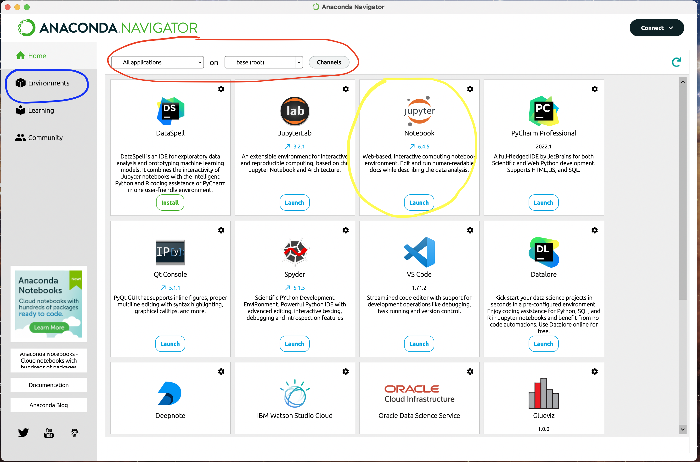
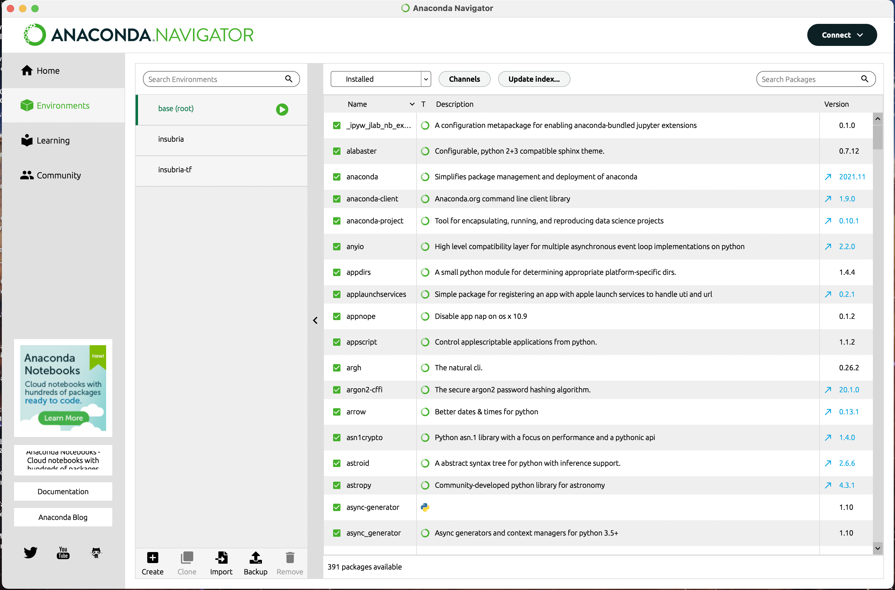
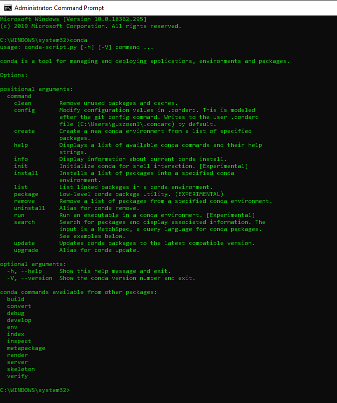

# Setup dell'ambiente e degli strumenti di lavoro

Questo breve documento ti insegnerà le basi di come impostare l'ambiente di lavoro necessari

## Installare Python

Cos'è [Python](https://docs.python.org/3/tutorial/index.html)?

Python è un linguaggio di programmazione potente e facile da imparare. 

Ha efficienti strutture dati di alto livello e un approccio semplice ma efficace alla programmazione orientata agli oggetti. 

L'elegante sintassi e la tipizzazione dinamica di Python, insieme alla sua natura interpretativa, ne fanno un linguaggio ideale per lo scripting e il rapido sviluppo di applicazioni in molte aree della maggior parte delle piattaforme.

L'interprete Python e l'ampia libreria standard sono liberamente disponibili in forma sorgente o binaria per tutte le principali piattaforme dal sito web [Python](https://www.python.org/), e possono essere liberamente distribuiti. 

Per ulteriori informazioni su come installare Python puoi seguire questa documentazione oppure il bellissimo sito di SoftPython che propone una bellissima documentazione: https://it.softpython.org/installation.html

### Cosa si può fare con Python? 

Quasi tutto (anche il caffè), e la maggior parte delle cose abbastanza facilmente. 

Argomenti come l'analisi dei dati, l'apprendimento automatico, lo sviluppo web, le applicazioni desktop, la robotica e altro ancora sono tutte cose che si possono immediatamente iniziare a fare con Python senza troppa fatica. 

Con Python quindi si può [programmare](https://pythonprogramming.net/introduction-learn-python-3-tutorials)! E la programmazione è lo strumento del nostro secolo che consente di lavorare con i computers su qualsiasi applicazione e a qualsiasi livello! È risaputo oramai che il software sta dominando il nostro tempo ed è importante anche solo capire cosa vuol dire.

Se volete installare il Python sulla vostra macchina ci sono diversi modi:

1. Se siete alle prime armi vi consigliamo di installare [Anaconda](https://www.anaconda.com/distribution/) seguendo [la guida qui sotto](#anaconda), un ambiente di sviluppo integrato (IDE) che contiene già tutto il necessario per iniziare a programmare in Python.
2. Scaricarlo e installarlo direttamente dal sito ufficiale: https://www.python.org/downloads/
3. Utilizzare alcuni strumenti online gratuiti che vi consentono di scrivere codice senza doverlo installare direttamente sul vostro computer:
   1. Replit: https://replit.com/languages/python3 
   2. Jupyter online: https://jupyter.org/try
   3. Google Colab: https://colab.research.google.com/
4. Ci sono tante altre distribuzioni e modi per poterlo installare ed eseguire...

In alcune macchine (mac, linux) sarà installata di default la versione 2.7 di python, vi chiediamo di non usare la versione 2.x per problemi di incompatibilità, ma di utilizzare solamente la versione 3.X (in particolare dalla versione 3.8 in sù).


## Anaconda

- Cos'è l'anaconda
- Installare
- GUI vs linea di comando

Anaconda è una distribuzione open source dei linguaggi di programmazione Python e R. Per distribuzione intendiamo un insieme di librerie, software e tools installati e configurati in automatico dai creatori di Anaconda.

L'utilizzo di Anaconda è consigliato perchè consente di utilizzare Python in modo più semplice e veloce, senza dover installare manualmente le librerie e gli strumenti da terminale.

La distribuzione Anaconda è usata da oltre 7 milioni di utenti, e comprende più di 300 pacchetti di scienza dei dati adatti a Windows, Linux e MacOS.

Se vuoi installare Anaconda scarica la versione 3.X da qui: https://www.anaconda.com/distribution/

L'Anaconda ha due tipi di interazione:

- Approccio grafico
- Approccio basato su terminale

L'approccio grafico si ha utilizzando e aprendo: **Anaconda Navigator** una GUI che può aiutare ad utilizzare gli strumenti che è disponibile una volta installato Anaconda sul proprio computer.

Una volta installato Anaconda e aperto **Anaconda Navigator** potrete visualizzare la seguente applicazione:



Nell'immagine qui sopra sono evidenziate alcune funzionalità del navigator:

- **La parte blu**: è dove puoi gestire alcuni diversi ambienti python-conda (ne parleremo nel prossimo cpt.)
- **La parte rossa**: è dove è possibile modificare gli ambienti installati e le relative app
- **La parte gialla**: sono le app installate in un ambiente specifico che puoi usare


Se apri la **parte blu** (ambienti o environments in inglese) puoi trovare tutti gli ambienti (environments) installati. Un ambiente (o environment) è un "contenitore" che contiene tutte le librerie extra installate in un determinato luogo. Questo è utile per poter avere più ambienti con librerie diverse e poterle utilizzare in modo indipendente. Se volete approfondire la questione degli ambienti vi rimandiamo alla sezione [Virtual Environment](#virtual-environment)



L'interfaccia grafica semplifica l'utilizzo di Anaconda, ma il modo migliore per usare anaconda è con il terminale, dopo l'installazione apri CMD (o la tua app terminale) e puoi interagire con Anaconda usando il comando: `conda`



Ecco qualche utile comando utilizzando il terminale:

- Informazioni sull'installazione di Conda
```bash
conda -v
```

- Aggiorna anaconda
```bash
conda update conda
```

- Per vedere i tuoi ambienti
```bash
conda env list
```

- Elenco dei pacchetti nei tuoi ambienti
```bash
conda list
```

- Crea un nuovo ambiente virtuale (venv) con una specifica versione di Python. Ricorda di sostituire x.x con la tua versione di Python (usiamo principalmente la versione 3.6) e "nomeambiente" con il nome del tuo ambiente
```bash
conda create -n nomeambiente python = x.x anaconda
```

- Se vuoi creare un ambiente vuoto senza le librerie di conda predefinite puoi fare:
```bash
conda create -n nomeambiente python = x.x
```

- Attivare un ambiente di Anaconda
```bash
conda activate nomeambiente
```

- Per installare una nuova libreria nel tuo nuovo ambiente, senza prima attivare un ambiente specifico puoi fare (senza parentesi quadre):
```bash
conda install -n nomeambiente [nome_libreria]
```

- Ma se hai già attivato il tuo ambiente di Anaconda, puoi semplicemente lanciare questo comando (senza parentesi quadre):
```bash
conda install [nome_libreria]
```

- Per uscire dal proprio ambiente virtuale
```bash
conda deactivate
```

- Se si vuole eliminare un ambiente virtuale di anaconda:
```bash
conda remove -n nomeambiente -all
```

Ricordiamo che tutto quello che si può eseguire utilizzando questi comandi da terminale è possibile anche farlo all'interno dell' **Anaconda Navigator** da interfaccia grafica.

## Virtual Environment

Lo scopo principale degli ambienti virtuali Python (chiamato anche venv) è quello di creare un ambiente isolato per i progetti Python. 

Ciò significa che ogni progetto può avere le proprie dipendenze e librerie, indipendentemente dalle dipendenze e librerie installate in ogni altro progetto.

Nel nostro piccolo esempio qui sopra, avremmo solo bisogno di creare un ambiente virtuale separato sia per ProjectA che ProjectB, e saremmo pronti a partire. Ogni ambiente, a sua volta, sarebbe in grado di dipendere da qualunque versione di ProjectC scelga, indipendentemente dall'altro.

Il bello di questo è che non ci sono limiti al numero di ambienti che puoi avere dato che sono solo directory che contengono alcuni script. Inoltre, possono essere facilmente creati utilizzando gli strumenti da riga di comando virtualenv o pyenv.

È possibile creare un ambiente virtuale con Python predefinito, ma utilizziamo ambienti con Anaconda. Per informazioni standard su Python relative agli ambienti virtuali, vedere questo link di seguito:
https://realpython.com/python-virtual-environments-a-primer/

Esistono 2 tipi di scenari che è possibile seguire per installare nuovi pacchetti o librerie Python utilizzando Anaconda:

- Usando pip
- Usando conda
- Utilizzando altri strumenti (pipx, pyenv, poetry, ...)

Conda e Pip sono due gestori di librerie, il primo è il gestore python predefinito e il secondo è il gestore predefinito di Anaconda. Le librerie disponibili da entrambi i gestori possono essere diversi, quindi ti suggeriamo di utilizzare entrambi i managers ma dando la priorità all'uso di Conda.

AVVERTENZA: se si utilizza pip, è necessario che l'ambiente sia attivato ed essere al suo interno.

Se vuoi qualche altra informazione vedi questo articolo (specialmente se vuoi usare un file requisito.yml personalizzato per le tue librerie Python) https://towardsdatascience.com/getting-started-with-python-environments-using-conda-32e9f2779307

## Jupyter

Jupyter Notebook è un'applicazione Web open source che consente di creare e condividere documenti che contengono codice in tempo reale, equazioni, visualizzazioni e testo narrativo. Gli usi includono: pulizia e trasformazione dei dati, simulazione numerica, modellistica statistica, visualizzazione dei dati, apprendimento automatico e molto altro.

È lo strumento predefinito per questo laboratorio ed è uno degli strumenti comuni per scrivere codice velocemente e visualizzare immediatamente i risultati. È utilizzato moltissimo nel mondo dei Dati quando si fa analisi esplorativa ad esempio.

Jupyter è installato per impostazione predefinita all'interno dell'ambiente conda di base utilizzando l' **Anaconda Navigator** e premendo sull'icona **Jupyter Notebook** che compare nell'interfaccia grafica.

Ricordatevi che è possibile anche selezionare prima un particolare ambiente (environment) conda differente da utilizzare.

Se invece si utilizza all'interno del terminale e di un nuovo ambiente virtuale, è necessario prima installarlo come libreria esterna

Per installare jupyter all'interno di un ambiente (environment) è necessario:

- attivare l'ambiente virtuale creato (venv) con anaconda: `conda activate <nomeambiente>`
- eseguire su terminale: `conda install jupyter` per installare jupyter
- eseguire jupyter da terminale digitando: `jupyter notebook`

Ogni volta che vuoi lanciare il notebook Jupyter con il tuo ambiente virtuale conda personalizzato devi:

- attivare il tuo environment conda
- eseguire: jupyter notebook all'interno del terminale

quindi apparirà una nuova finestra del browser e potrai usare Jupyter da lì con il tuo ambiente (environment).

Se vuoi chiudere Jupyter:

- salva il tuo lavoro
- chiudere le schede del browser
- premere: CRTL + C all'interno delle finestre del terminale per terminare tutti i kernel e il server jupyter

Se vuoi estendere e aggiornare Jupyter con nuove funzionalità, puoi seguire questa guida: https://ndres.me/post/best-jupyter-notebook-extensions/

### Jupyter Lab

JupyterLab è un ambiente di sviluppo interattivo Web per i Jupyter notebooks. 

JupyterLab è flessibile: configura e organizza l'interfaccia utente per supportare un'ampia gamma di flussi di lavoro nella scienza dei dati, informatica scientifica e machine learning. 

JupyterLab è estensibile e modulare: scrivi plugin che aggiungono nuovi componenti e si integrano con quelli esistenti.

Rispetto ai notebook jupyter, jupyter lab è una singola pagina web con molte più funzionalità e un'interfaccia estesa, è quasi un IDE più complesso.

Per installare jupyter lab in conda utilizzando il terminale:

- attivare l'ambiente virtuale creato (venv) con anaconda: `conda activate <nomeambiente>`
- lanciare il comando: `conda install jupyterlab`
- eseguire jupyter digitando sul terminale: `jupyter lab`

Ogni volta che vuoi lanciare il notebook Jupyter con il tuo ambiente virtuale conda personalizzato devi:

- attivare il tuo conda environment
- eseguire: jupyter lab all'interno del terminale

**Problemi noti**


Utilizzando jupyter su un environment creato a mano è possibile che non vi trovi i pacchetti installati, questo perchè si sta utilizzando jupyter installato nell'environment di default oppure in un altro ambiente, ma non nell'ambiente di riferimento della libreria installata.


Quando questo si verifica ricordate di installare jupyter all'interno del vostro nuovo ambiente (environment) di lavoro.

## Visual Studio Code

[Visual Studio Code](https://code.visualstudio.com/) è un editor di codice sorgente sviluppato da Microsoft per Windows, Linux e macOS. Include supporto per debug, controllo Git incorporato e GitHub, evidenziazione della sintassi, completamento del codice intelligente, frammenti e refactoring del codice.

È un IDE utile per sviluppare applicazioni potenti e complesse con Python ed è consigliato quando si desidera creare, progettare, progettare e costruire applicazioni o codici di produzione di grandi dimensioni.

Per ulteriori informazioni e approfondimenti, potete guardare la documentazione ufficiale oppure quella presente sul nostro sito: https://pythonbiellagroup.it/it/visual-studio-code/

Visual Studio Code è compatibile con Python e puoi seguire questa guida per utilizzare con: https://code.visualstudio.com/docs/python/python-tutorial

Con il codice Visual Studio puoi anche usare celle di codice come il quaderno Jupyter. Non sono gli stessi, ma l'uso è abbastanza simile grazie a IPython che è il pacchetto base su cui è stato creato Jupyter. Per utilizzare i notebook, seguire questa guida: https://code.visualstudio.com/docs/python/jupyter-support

Ecco alcune estensioni utili che si possono installare su Visual Studio Code:

- Anaconda extension pack
- Code Runner
- Git History
- Git Lens
- Live share
- Powershell
- Python
- Project manager
- Shell launcher
- vscode-icons

## Git


Git è un software di controllo versione distribuito Creato da Linus Torvalds nel 2005 per gestire il codice Linux Può essere utilizzato dalla riga di comando Disponibile anche su Windows Potrebbe avere un repository "centrale" più importante degli altri

È lo strumento fondamentale di base per cooperare in gruppo, condividendo codice e "cosa di programmazione" tra loro.

Lo scopo di Git è gestire un progetto, o un insieme di file, mentre cambiano nel tempo. Git archivia queste informazioni in una struttura di dati chiamata repository. Un repository git contiene, tra le altre cose, quanto segue: Un set di oggetti commit.

Ci sono anche aziende che estendono e usano git per molti scopi, due esempi sono: Github e GitLab.

GitHub è un servizio di hosting di repository Git, ma aggiunge molte delle sue funzionalità. Mentre Git è uno strumento da riga di comando, GitHub fornisce un'interfaccia grafica basata sul Web. Fornisce inoltre il controllo degli accessi e diverse funzionalità di collaborazione, come wiki e strumenti di gestione delle attività di base per ogni progetto.

I servizi di gestione dei repository di controllo versione come Github e GitLab sono un componente chiave nel flusso di lavoro di sviluppo software. Negli ultimi anni, GitHub e GitLab si sono posizionati come assistenti utili per gli sviluppatori, in particolare quando lavorano in team di grandi dimensioni.

Entrambi, GitLab e GitHub sono repository Git basati sul web.

Lo scopo di Git è gestire i progetti di sviluppo software e i suoi file, poiché cambiano nel tempo. Git archivia queste informazioni in una struttura di dati chiamata repository.

Tale repository git contiene un set di oggetti commit e un set di riferimenti per eseguire il commit di oggetti.

Un repository git è un luogo centrale in cui gli sviluppatori archiviano, condividono, testano e collaborano a progetti Web.

Ci sono alcune differenze tra Gitlab e Github, ma i punti chiave sono gli stessi.

**Installa Git**

Scarica git da qui: https://git-scm.com/downloads usando l'emulazione POSIX in Windows.

per i geek, puoi seguire questa guida per Windows con sottosistema Linux: https://docs.microsoft.com/en-us/windows/wsl/about

**Guida semplice su Git**


http://rogerdudler.github.io/git-guide/

**Git tutorial interattivo**


https://learngitbranching.js.org/

**Usare Github**

L'uso di GitHub è assolutamente consigliato e consigliato per familiarizzare con questi strumenti per questo corso.

Ti consigliamo di creare un account su GitHub e utilizzarlo per i progetti e il codice che creerai in questo lab e percorso.

Usa questo tutorial per capire come usare GitHub https://product.hubspot.com/blog/git-and-github-tutorial-for-beginners